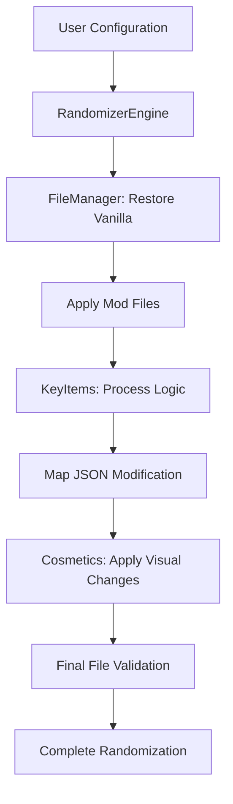

# Design Document

## Overview

The FF1 randomizer core logic stabilization focuses on ensuring reliable operation of crystal key items, map event integration, cosmetic flags, and overall data consistency. The system works by modifying CSV files and JSON map events, then placing them in a mods folder structure for consumption by the FF1 Pixel Remaster mod framework.

Key areas of concern identified:
- Crystal key item SysCall integration causing crashes/freezes
- Map event JSON modification and validation
- Cosmetic flag consistency across different randomization modes
- Data file reference validation between vanilla and randomizer-specific content
- Hard-coded logic validation in map files

## Architecture

### Core Components

1. **RandomizerEngine** - Central orchestration of all randomization processes
2. **KeyItems** - Handles key item placement and map event modification
3. **FileManager** - Manages file operations and vanilla/mod file handling
4. **Cosmetics** - Handles visual randomization features
5. **Updater** - Manages file copying and directory structure creation

### Data Flow



## Components and Interfaces

### Crystal Key Item System

**Current Issues Identified:**
- Crystal SysCall references may be inconsistent or missing
- Map event JSON modification doesn't properly validate crystal-specific logic
- Hard-coded Japanese SysCall strings may not match expected values

**Stabilization Approach:**
- Validate all crystal SysCall mappings: `黄色クリスタル点灯`, `赤色クリスタル点灯`, `青色クリスタル点灯`, `緑色クリスタル点灯`
- Ensure proper SysCall insertion when crystals are placed in non-standard locations
- Add validation for crystal event sequences in map JSON files

### Map Event Integration

**Current Architecture:**
- Uses `Updater.MemoriaToMagiciteFile()` to resolve file paths
- Modifies JSON event files directly using Newtonsoft.Json
- Handles multiple event types: GetItem, SetFlag, MsgFunfare, SysCall

**Stabilization Requirements:**
- Validate all map file references exist before modification
- Ensure JSON structure integrity after modifications
- Add error handling for missing or malformed map files
- Validate that hard-coded logic references correct data files

### File Management System

**Current Structure:**
```
FINAL FANTASY_Data/StreamingAssets/Magicite/FF1PRR/
├── master/Assets/GameAssets/Serial/Data/Master/ (CSV files)
├── message/Assets/GameAssets/Serial/Data/Message/ (text files)
└── [mapname]/Assets/GameAssets/Serial/Res/Map/[mapname]/ (JSON files)
```

**Validation Needs:**
- Ensure all vanilla file references are correct
- Validate mod file structure matches expected format
- Check for conflicts between vanilla and randomizer-specific data
- Verify directory structure creation is consistent

### Cosmetic Flag System

**Current Implementation:**
- Battle background shuffling via CSV modification
- Sprite replacement through directory copying
- Vehicle sprite modifications

**Consistency Issues:**
- Cosmetic flags may not apply uniformly across all game elements
- Potential conflicts between different cosmetic options
- Missing validation for cosmetic file integrity

## Data Models

### Key Item Location Data
```csharp
private class locationData
{
    public int keyItem { get; set; }    // Flag ID for the key item
    public int ff1Event { get; set; }   // Location ID where item is placed
}
```

### Event JSON Structure
```csharp
public class EventJSON
{
    public Mnemonic[] Mnemonics { get; set; }
    
    public class Mnemonic
    {
        public string mnemonic { get; set; }    // Event type (GetItem, SetFlag, etc.)
        public Operands operands { get; set; }
        public int type { get; set; }
        public string comment { get; set; }
    }
}
```

### Database Edit Structure
```csharp
private class DatabaseEdit
{
    public string file { get; set; }     // Target CSV file
    public string id { get; set; }       // Record ID to modify
    public string field { get; set; }    // Field to update
    public string value { get; set; }    // New value
}
```

## Error Handling

### Crystal Logic Validation
- Validate crystal SysCall strings match expected Japanese text
- Check for proper crystal event sequence in map files
- Ensure crystal flags are properly set in game state

### Map File Integrity
- Validate JSON structure before and after modification
- Check for required event mnemonics (MsgFunfare, GetItem, SetFlag)
- Ensure file paths resolve correctly through Updater methods

### Data Consistency Checks
- Verify CSV file structure matches expected format
- Validate all referenced files exist before processing
- Check for conflicts between different randomization options

### Cosmetic Flag Validation
- Ensure sprite files exist before attempting replacement
- Validate cosmetic CSV modifications don't break game logic
- Check for proper directory structure in mod files

## Testing Strategy

### Unit Testing Focus Areas
1. **Crystal SysCall Mapping** - Test all crystal types map to correct Japanese strings
2. **Map File Path Resolution** - Validate Updater.MemoriaToMagiciteFile() returns correct paths
3. **JSON Event Modification** - Test event insertion/modification preserves structure
4. **File Existence Validation** - Test error handling for missing files
5. **CSV Edit Application** - Validate database edits apply correctly

### Integration Testing
1. **End-to-End Crystal Placement** - Test crystal placement in all valid locations
2. **Cosmetic Flag Combinations** - Test various cosmetic flag combinations
3. **File System Operations** - Test complete randomization process
4. **Error Recovery** - Test graceful handling of various error conditions

### Validation Testing
1. **Data File Integrity** - Validate all generated files are properly formatted
2. **Game Compatibility** - Ensure modifications work with target mod framework
3. **Performance Testing** - Validate randomization completes in reasonable time
4. **Regression Testing** - Ensure fixes don't break existing functionality

### Test Data Requirements
- Sample map JSON files with various event configurations
- Test CSV files with known good/bad data
- Mock file system scenarios for error testing
- Crystal placement test cases covering all locations and combinations